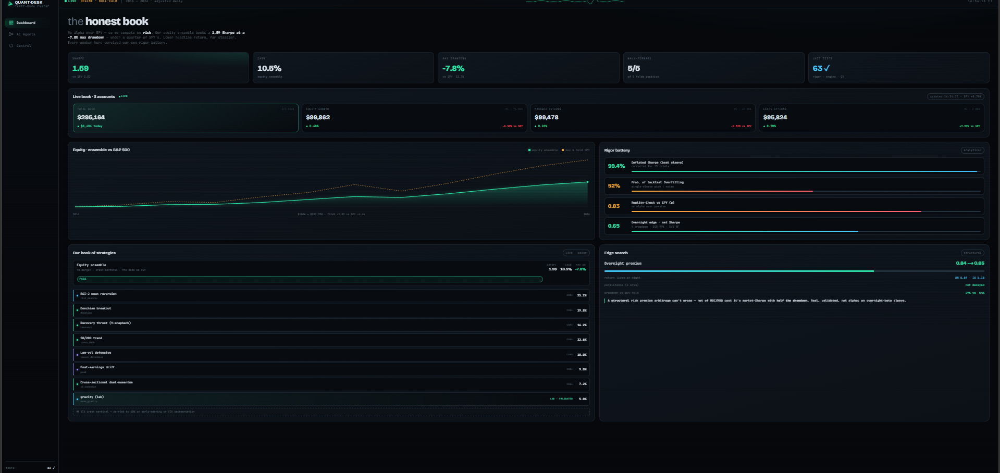
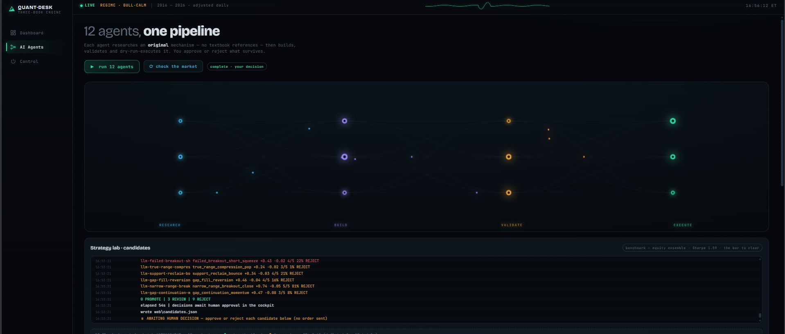
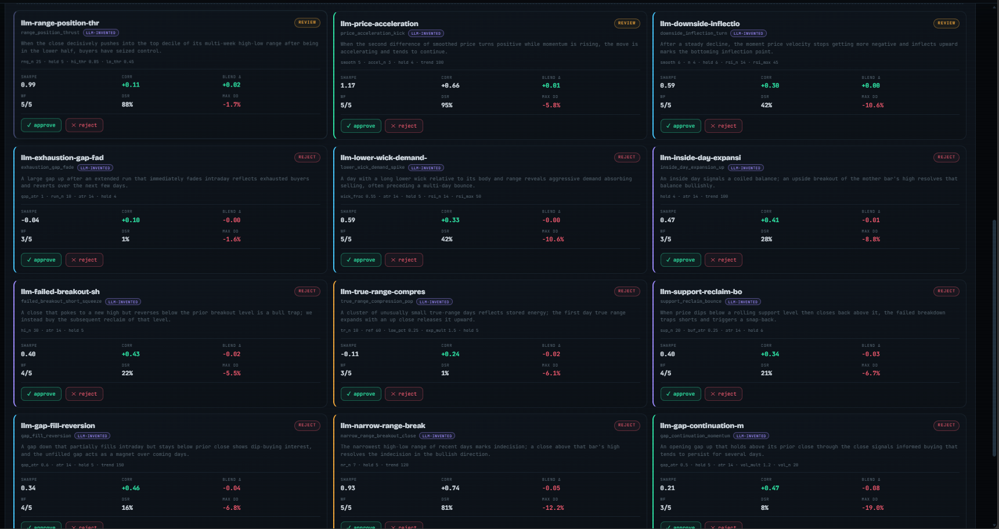
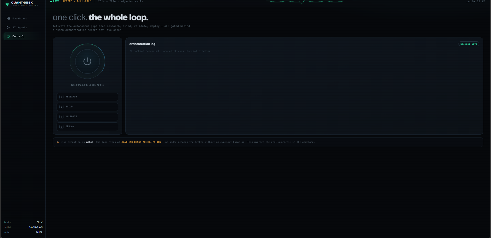

# quant-agent

A research-grade, multi-engine systematic trading system: it **researches,
statistically validates, and paper-trades** daily/multi-day strategies across three
independent books — and, just as importantly, it is built to *prove what is real and
admit what isn't*. Built on free split/dividend-adjusted daily data (yfinance), Alpaca
paper trading, and a from-scratch statistical-rigor + backtesting toolkit.

> **What makes this project credible isn't a big backtested Sharpe — it's the
> machinery that stops us fooling ourselves.** We deflate Sharpes for the number of
> strategies tried, measure the probability of backtest overfitting, run data-snooping
> tests, validate ML with purged/embargoed cross-validation, and backtest on a
> look-ahead-free event engine. The honest conclusion of all that rigor is below, and
> it is not "we beat the market with secret alpha."

## 🎥 Demo

**[Watch the demo on YouTube →](https://youtu.be/q9O1Rz0A4FI)** — a walkthrough of the
cockpit (live dashboard, the 12 AI agents inventing and validating strategies via the
Claude API, and the one-click control pipeline) and the rest of what we built.

### The cockpit (`python web/server.py` → http://127.0.0.1:8787)

**Dashboard** — live 3-account book, the equity-ensemble curve vs SPY, and the rigor battery.


**AI Agents — going to work** — one click sends the 12 agents to invent fresh strategies via the Claude API.


**AI Agents — finished** — each invented strategy, validated against the ensemble (Sharpe, correlation, walk-forward, deflated Sharpe) and laid out for you to approve or reject.


**Control** — one-click research → build → validate → deploy pipeline, gated before any live order.


---

## The two core findings

1. **Intraday → daily.** 1-minute strategies do **not** survive realistic costs (6 bps
   round-trip): across 30+ strategies, loss magnitude tracked trade count almost
   perfectly. The edge appears only on **daily/multi-day holds**, where the same cost is
   amortized over a multi-week move. ([LESSONS.md](LESSONS.md))

2. **No reliable alpha over SPY — so compete on *risk*, not raw return.** Our own rigor
   battery (below) shows single-strategy selection is ~indistinguishable from noise
   (PBO ≈ 52%) and no sleeve beats buy-and-hold SPY after data-snooping correction
   (Reality-Check / SPA *p* ≈ 0.83). The defensible edge is **drawdown reduction**: a
   crash-sentinel overlay delivers SPY-like return at a **higher Sharpe and a third less
   drawdown**. We say this plainly rather than curve-fit a prettier number.
   ([RESEARCH.md](RESEARCH.md))

---

## Architecture — three independent books

| Book | Mandate | Posture |
|---|---|---|
| **Account 1 — Equity** | 7-sleeve long/flat ensemble (momentum, mean-reversion, PEAD, low-vol, recovery) + optional crypto | no margin (≤1.0×); vol-targeted; crash-sentinel de-risk |
| **Account 2 — Managed futures** | time-series & cross-sectional momentum, long/short | crisis-alpha diversifier, ~uncorrelated |
| **Account 3 — Options (WIP)** | deep-ITM LEAPS as defined-risk share-replacement | held; lifecycle manager (roll/stop) still to build — needs paid options data |

**No-margin posture (board decision):** vol-targeting can only *de-risk* (scale ≤ 1.0×),
never borrow — the book **cannot be margin-called**. Leverage was tested and rejected:
`leverage_compare.py` shows it raises CAGR *and* drawdown together with **flat Sharpe**.

---

## Research & rigor infrastructure ⭐

This is the part a quant desk should care about. Three from-scratch packages (no scipy
in `analytics`), all unit-tested (**63 tests passing**):

### `analytics/` — does the edge survive scrutiny?
- **Deflated Sharpe Ratio** (Bailey & López de Prado) — corrects Sharpe for non-normal
  returns *and* the number of strategies tried.
- **Probability of Backtest Overfitting** via combinatorially-symmetric CV.
- **White's Reality Check** + **Hansen's SPA** — data-snooping p-values via stationary
  block bootstrap.

Run on all 13 sleeves (`runners/rigor_report.py`): best sleeve **DSR 99.4%** (real vs
zero) but **PBO 52%** (selection is noise) and **RC/SPA p ≈ 0.83** (no alpha vs SPY).
*This finding is what justifies the equal-weight ensemble + sentinel design.*

### `backtest/` — a look-ahead-free event engine
Classic `MarketEvent → SignalEvent → OrderEvent → FillEvent` loop. The data handler
hard-bounds reads to `iloc[:cursor+1]`, so look-ahead bias is **impossible by
construction**. Validated against the vectorized backtester (`runners/bt_parity.py`):
trend rule on SPY matches at **Sharpe 0.751 = 0.751, correlation 1.000000**.

### `ml/` — machine learning done correctly (and the honest negative)
PurgedKFold (purge overlapping labels + embargo), triple-barrier labels, trailing-only
features. Result across four principled experiments
(`ml_signal`, `ml_meta_label`, `ml_volatility`, `ml_orthogonal`):
**direction is unpredictable** (OOS AUC ≈ 0.50), **meta-labeling doesn't help**, and even
**volatility ML loses to a one-line persistence baseline**. The parsimonious baseline wins
every time. The only untested lever is *paid* data (options IV surface). We stopped rather
than tune to a green number.

---

## The autonomous strategy lab — 12 agents ⭐

A self-contained research desk that invents and vets **original** strategies, then asks a
human to approve or reject what survives. Launchable in one click from the web cockpit's
**AI Agents** tab, or headless via `python runners/agent_lab.py`.

* **`agents/lab_strategies.py` — 12 in-house mechanisms, no public references.** Volatility
  *coil release*, a graded *drawdown ladder*, price *acceleration flip*, *path persistence*,
  a *volatility-regime allocator*, *overnight gap-down fade*, *internal breadth thrust*,
  *ATR-stretch gravity*, *down-streak overreaction*, *range-expansion ignition*, *trend
  R²-quality*, and *dual-horizon agreement* — each a first-principles construction with its
  own distinct parameter set (not a re-skinned RSI/Bollinger).
* **`runners/agent_lab.py` — the loop.** Each agent runs **research → build → validate →
  execute (dry-run)**. The bar is **our equity ensemble (Sharpe ≈ 1.59), not buy-&-hold
  SPY**: a candidate wins by *raising the blended Sharpe* (decorrelation), measured as the
  marginal contribution of a 15% sleeve, then stress-tested with walk-forward folds and a
  **deflated Sharpe corrected for searching 12 trials**. Every candidate gets a
  PROMOTE / REVIEW / REJECT recommendation written to `web/candidates.json`.
* **`agents/llm_strategist.py` — LLM-INVENTED mechanisms.** The cockpit button (and
  `agent_lab.py --llm`) has Claude invent a fresh batch of original signals each run, as
  small Python functions. Because this executes model-written code, two hard guards run
  *before* any backtest: an **AST sandbox** (no imports / file-IO / eval / dunders / pandas
  `.eval`·`.query`·`.to_*`·`read_*`) and a **look-ahead probe** (recompute on truncated
  history — reject anything whose past value changes once the future is hidden, catching
  global `.max()`, negative `.shift()`, future indices). Unreachable LLM → it falls back to
  the parameter-search batch, so the button always works.
* **Human-in-the-loop.** The cockpit renders each candidate as a card with its metrics and a
  ✓ approve / ✕ reject button (`/api/decide` → `web/decisions.json`); approve also adds the
  sleeve to `web/book.json`. **The machine proposes; the human disposes** — nothing here ever
  places a live order.

**Honest result (latest run):** of 12 original mechanisms, **2 raise the blended Sharpe** —
`mean_gravity` (corr **+0.22**, blend **1.61**, 5/5 folds) is a genuine low-correlation
diversifier in the spirit of the capitulation sleeve, and `vol_regime_switch` (DSR **99%**)
helps but is too correlated (0.81) to add much. The other 10 are honest rejects: the
ensemble already owns those return shapes — consistent with the **diversification ceiling**.
The lever remains *decorrelation*, not another high-Sharpe long-equity sleeve.

**`mean_gravity` cleared walk-forward and was promoted** (`runners/validate_mean_gravity.py`):
positive standalone in **5/5** folds, blend improves in 3/4, 4/5 and 5/6 contiguous folds,
PSR-vs-zero 99%, survives the 12-trial deflation (DSR 64%, clears the SR\* 0.67 hurdle). It's
in the book at a **conservative 5% pilot weight** (in-sample optimum was 25% — deliberately not
used). Each `run 12 agents` now also samples a **fresh parameter batch**, so the desk keeps
exploring new candidates rather than re-testing the same twelve.

---

## The deployable book + today's fix

The live Account-1 book (`run_rebalance.ps1`):
```
--book portfolio_full --xs-universe sp500 --vol-target 0.17 --max-leverage 1.0 --crypto-sleeve --trail-pct 20
```

**Why we were trailing SPY (diagnosed 2026-06):** the selective sleeves only ask for
~62% of capital; the rest sat in **T-bills (BIL)**, leaving the book at **beta 0.52** —
so it structurally lagged SPY in a bull run. That's a design choice ("sit in cash when no
sleeve fires"), not a bug.

**The fix — regime-aware parking (`--park-market SPY`):** default idle capital to the
**market** while RISK-ON, falling back to BIL only when the crash sentinel de-risks. At
the index level (`runners/market_park_backtest.py`, 2016–2026):

| | CAGR | Sharpe | maxDD |
|---|---|---|---|
| Buy & hold SPY | 13.9% | 0.82 | −33.7% |
| **Market + sentinel de-risk** | **13.6%** | **0.97** | **−22.8%** |

SPY-like return, **+0.15 Sharpe, ~11 points less drawdown** (COVID −22% vs −33%). This is
the honest "beat SPY" — through-cycle and risk-adjusted, not a bull-market sprint.

**The crash sentinel** (deployed): de-risk to 60% when *either* the early-warning
(SPY < 50-day & 20-day vol > 20%) *or* **VIX backwardation** (spot VIX ≥ 3-month VIX)
fires — the latter front-runs fast crashes ~2.5× faster.

> **Honest caveats:** long-biased, validated over a 2016–2026 bull-heavy sample; not
> market-neutral. The market-park raises exposure (and downside) toward SPY by design —
> it's a risk choice, not free alpha. Paper-trade before real capital.

---

## Quick start

```powershell
python -m venv .venv
.venv\Scripts\Activate.ps1
pip install -r requirements.txt
cp env.example .env          # ALPACA_* keys (1/2/3), optional ANTHROPIC/data keys
```

### Inspect the rigor + performance
```powershell
python runners\rigor_report.py          # Deflated Sharpe, PBO, Reality-Check/SPA
python runners\bt_parity.py             # event-engine vs vectorized parity
python runners\market_park_backtest.py  # market-park + sentinel vs buy-hold SPY
python runners\account_vs_spy.py --account 1   # live account vs SPY (since inception)
python runners\agent_lab.py             # the 12-agent strategy lab (research->...->execute)
pytest tests/                           # 63 tests
```

### Run the cockpit (web UI + live backend)
```powershell
python web\server.py                    # http://127.0.0.1:8787  (Ctrl+C to stop)
```
Opens the dashboard, the animated **AI Agents** desk (one click runs the real 12-agent lab
and streams it live, then you approve/reject each candidate), and the **Control** page
(runs the real research→build→validate→deploy pipeline, gated before any live order).
Opening `web/index.html` directly still works as an offline demo.

### Paper-trade (dry-run first, then --live)
```powershell
# deployed Account-1 book, now tracking the market when risk-on:
python runners\daily_rebalance.py --book portfolio_full --xs-universe sp500 `
    --vol-target 0.17 --max-leverage 1.0 --crypto-sleeve --park-market SPY            # dry-run
python runners\daily_rebalance.py --book portfolio_full --xs-universe sp500 `
    --vol-target 0.17 --max-leverage 1.0 --crypto-sleeve --park-market SPY --live     # submit
```
Run once per trading day before the 6:30 AM PST open (decides off prior close, fills at
open). `run_rebalance.ps1` wraps it for Windows Task Scheduler.

---

## Monitoring & diagnostics
```powershell
python runners\daily_vs_spy.py                  # today's P&L per account vs SPY
python runners\account_vs_spy.py --account 1    # overall vs SPY + current allocation
python runners\positions_detail.py --account 3  # options: mark vs intrinsic (stale-quote check)
python runners\monitor.py                       # regime-posture check + track record
```

## Repository layout
```
quant-agent/
├── README.md  RESEARCH.md  LESSONS.md  BUILD_PLAN.md  STRATEGIES.md   docs + findings
├── config.py                       tunables, RISK gate, alpaca_keys(1/2/3)
├── analytics/                      ★ statistical rigor: significance, pbo, reality_check
├── backtest/                       ★ look-ahead-free event engine (events/data/.../engine)
├── ml/                             ★ purged CV, triple-barrier labels, features
├── agents/
│   ├── daily_strategies.py         daily sleeves, $100k portfolio backtester, vol-target
│   └── execution_agent.py          Alpaca paper orders (equities + options + trailing stops)
├── runners/                        CLI entrypoints (rebalance, rigor, ML, diagnostics)
├── app/dashboard.py                Streamlit control panel (3 books + AI monitor)
├── tests/                          63 tests (rigor, engine, purged-CV, stop-guard, mapping)
└── data/                           S&P 500 list + adjusted daily loader (yfinance)
```

## Risk gate (`config.RISK`)
```python
RISK = {"min_sharpe": 0.8, "max_drawdown": -0.15, "min_win_rate": 0.45, "min_trades": 50}
```
A strategy reaches paper trading only after passing this gate **and** a walk-forward
(positive out-of-sample, positive in ≥ 4/5 folds) **and** the `analytics/` rigor battery.

## Read next
- **[RESEARCH.md](RESEARCH.md)** — the full research report: rigor results, the skew
  artifact, the BNY data glitch, the ML negatives, the diversification ceiling.
- **[BUILD_PLAN.md](BUILD_PLAN.md)** — the 5-tier build (1A rigor, 1B write-up, 2A engine,
  3 ML — all done; 2B Rust order book pending a toolchain).
- **[LESSONS.md](LESSONS.md)** — every strategy tried and why it was kept or killed.
