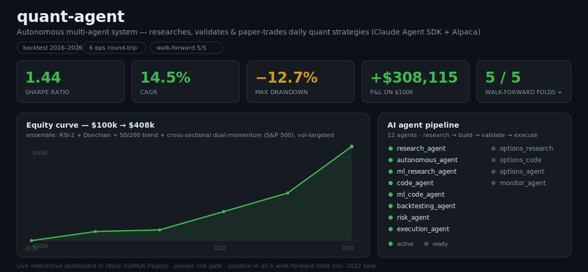

# quant-agent

An autonomous multi-agent system that researches, validates, and paper-trades
**daily / multi-day** quantitative trading strategies. Built on the Claude Agent
SDK + Alpaca paper trading + free split/dividend-adjusted daily data (yfinance).



### 📊 Live dashboard

An interactive dashboard (agent pipeline board, equity curve vs SPY, walk-forward,
book metrics) lives in [`docs/`](docs/index.html) and is built for **GitHub Pages**:

1. push the repo, then in **Settings → Pages** set *Source: Deploy from a branch*,
   branch `main`, folder **`/docs`**;
2. it goes live at `https://<you>.github.io/<repo>/`.

Regenerate its data after a change with `python runners/build_dashboard_data.py`
(writes `docs/data.json`), then commit `docs/`.

> **The core finding of this project:** 1-minute intraday strategies do **not**
> survive realistic costs (6 bps round-trip) — across 30+ strategies, loss
> magnitude tracked trade count almost perfectly. The edge appears once you move
> to **daily / multi-day holds**, where the same cost is amortized over a
> multi-week move. Everything below is built on that shift. See
> [LESSONS.md](LESSONS.md) for the full institutional record.

---

## The deployable strategy

A diversified **ensemble of six mechanisms**, each independently screened against
the risk gate and walk-forward, combined by weight and volatility-targeted:

| Component | Universe | Role |
|---|---|---|
| RSI-2 mean reversion (tuned) | 10 quality names | buy short-term dips in an uptrend |
| Donchian breakout (20/10) | 10 quality names | ride breakouts |
| 50/200 trend | 10 quality names | long-term trend |
| Cross-sectional dual-momentum | **full S&P 500** | hold top-10 relative-strength names; cash in bear markets |
| Recovery-thrust | 10 quality names | catch bull-run snapbacks off the 200-day (lean-year capture) |
| PEAD (post-earnings drift) | **full S&P 500** | hold gap-up earnings beats through the drift |

Three overlays on top: **vol-targeting** (17%, ≤1.8× conditional leverage),
**idle cash → BIL T-bills**, and an **early-warning de-risk** (cut to 60% when
SPY < 50-day and vol spikes, ahead of the lagging 200-day bear signal).

| Deploy book | Sharpe | $ PnL / $100k | CAGR | Max DD | Risk gate | Walk-forward |
|---|---|---|---|---|---|---|
| **`portfolio_full`** (6 sleeves, vol-target 17%, 1.8× cap) ⭐ | **1.46** | **+$469,050** | **18.2%** | **−13.1%** | ✅ PASS | ✅ 5/5 folds |
| `blended_plus` (equal-weight, no leverage) | 1.44 | +$308,115 | 14.5% | −12.7% | ✅ PASS | ✅ 5/5 folds |

Backtest: 2016–2026, adjusted daily data, 6 bps round-trip, well above the desk's
100-trades/year floor. **Positive in all 5 contiguous walk-forward folds**
(in-sample Sharpe 1.08 → out-of-sample 2.33; lean 2018–2020 ≈ +9%). `portfolio_full`
is the deployed 15–20% target book (conditional leverage); `blended_plus` is the
no-leverage floor. New strategies are auto-screened by
[`runners/portfolio_allocator.py`](runners/portfolio_allocator.py) — only those
passing Sharpe + walk-forward join. **Complete strategy reference (every sleeve,
overlay & parameter) in [STRATEGIES.md](STRATEGIES.md)**; full numbers in
[BOARD_SUMMARY.md](BOARD_SUMMARY.md).

**Also researched (no-leverage, not deployed):** options *income* sleeves that
harvest the volatility risk premium — a cash-secured **put-write** (modeled
Sharpe 1.26, −11% DD, beats the market in every down/flat year) and a covered
**call/buy-write** (Sharpe 1.43). Premiums are *modeled* (Black-Scholes + a
documented IV-vs-realized markup), pending live paper validation — see
[STRATEGIES.md](STRATEGIES.md) and `runners/options_income.py`.

> **Honest caveats:** long-only equity book validated over a 2016–2026 bull
> market — it is not market-neutral. Vol-targeting controls drawdown and the
> walk-forward through the 2022 bear is real evidence of resilience, but it should
> be paper-traded live for several weeks before any real capital. The 1.8× cap is
> *conditional* leverage (only in calm markets; de-risks when vol spikes). The
> cross-sectional sleeve can concentrate in the dominant momentum theme (semis/AI).

---

## Quick start

```powershell
python -m venv .venv
.venv\Scripts\Activate.ps1
pip install -r requirements.txt
cp env.example .env          # fill in ANTHROPIC / ALPACA keys (others optional)
```

### See the deployable book's numbers + walk-forward + risk
```powershell
python runners\deploy_check.py
```

### Paper-trade it (dry-run first, then --live)
```powershell
# DEPLOYED book: 6-sleeve portfolio_full, vol-targeted (17% vol, up to 1.8x in calm)
python runners\daily_rebalance.py --book portfolio_full --xs-universe sp500 --vol-target 0.17 --max-leverage 1.8           # dry-run (prints orders)
python runners\daily_rebalance.py --book portfolio_full --xs-universe sp500 --vol-target 0.17 --max-leverage 1.8 --live    # submit to Alpaca paper

# conservative, NO leverage (the floor):
python runners\daily_rebalance.py --book blended_plus --xs-universe sp500 --vol-target 0.12 --live
```
Run it **once per trading day, before the 6:30 AM PST open** (it decides off the
prior close and fills at the open). Orders are fractional (dollar-sized) with a
$250 no-trade band. `run_rebalance.ps1` wraps this for Windows Task Scheduler.

### Book menu (pick by risk appetite)
| Book | Sharpe | CAGR | Max DD | Notes |
|---|---|---|---|---|
| **`portfolio_full`** (6 sleeves + vol-target 17%/1.8×) ⭐ | 1.46 | 18.2% | −13.1% | deployed 15–20% target book |
| `blended_plus` + full-500 xs + vol-target | 1.44 | 14.5% | −12.7% | no leverage |
| `regime_adaptive --max-leverage 1.5` | 1.41 | 20.8% | −18.4% | aggressive growth (paper) |
| `defensive` (+ turn-of-month) | 1.22 | 8.3% | −8.3% | lowest risk |
| put-write (options income, modeled) | 1.26 | 9.2% | −11.1% | no-leverage defensive income (not deployed) |

> **Lean years:** this is a long-biased book — it has softer years in choppy/sideways
> markets (2018–2020 ≈ +9% total after the recovery sleeve + cash yield). 15–20% is a
> multi-year *average*, not a yearly guarantee. See [BOARD_SUMMARY.md](BOARD_SUMMARY.md) §8.

---

## Repository layout

```
quant-agent/
├── README.md / LESSONS.md / BOARD_SUMMARY.md   project docs + findings
├── WALK_FORWARD_SETTINGS.md / RSI2_STRATEGY_SPEC.md
├── config.py                       tunables (RISK thresholds, keys, DATA_DIR)
├── orchestrator.py                 strategy lifecycle + agent routing
│
├── agents/
│   ├── daily_strategies.py         ★ daily strategies, $100k portfolio backtester,
│   │                                  cross-sectional book, vol-targeting
│   ├── strategy_ledger.py          persistent record of every strategy tried
│   ├── research_agent / autonomous_agent / ml_research_agent   idea generation
│   ├── code_agent / ml_code_agent / options_code_agent          codegen (+retry)
│   ├── backtesting_agent.py        intraday engine + walk-forward + risk gate
│   ├── risk_agent.py               config.RISK gate
│   └── execution_agent.py          Alpaca paper orders (qty + fractional/notional)
│
├── runners/                        CLI entrypoints (see below)
├── data/
│   ├── sp500.py                    S&P 500 list + adjusted daily loader (yfinance)
│   ├── yfinance_loader.py / multi_source.py / loader.py
└── vector_stores/                  ChromaDB regime / strategy / research stores
```

### Key runners
| Script | Purpose |
|---|---|
| `deploy_check.py` | PnL + risk gate + walk-forward for every book + the deploy ensemble |
| `daily_book.py` | board report for the daily books on any universe |
| `daily_rebalance.py` | live/dry-run Alpaca paper rebalancer (the deploy path) |
| `walk_forward_daily.py` | anchored walk-forward with per-fold parameter re-optimization |
| `cross_sectional.py` | cross-sectional momentum / dual-momentum sweep |
| `derisk_wf.py` | vol-targeting + walk-forward on the high-return books |
| `strategy_lab.py` | candidate-strategy correlation lab + blend tuning |
| `options_income.py` | no-leverage options income (put-write / covered call), modeled vol-risk-premium + VRP sensitivity |
| `new_sleeves_screen.py` | screens candidate equity sleeves against the gate + marginal book value |
| `dump_daily_trades.py` | per-trade CSV logs |
| `verify_trades_vs_yfinance.py` | data-integrity audit (fills vs yfinance OHLC) |
| `data_quality_check.py` / `trade_stats.py` | data + win-rate significance diagnostics |
| `full_auto_pipeline.py` | the multi-agent research→backtest→risk loop |

---

## Risk gate (`config.RISK`)

```python
RISK = {"min_sharpe": 0.8, "max_drawdown": -0.15,
        "min_win_rate": 0.45, "min_trades": 50}
```
A strategy graduates to paper trading only after passing this gate **and** a
walk-forward (positive out-of-sample, positive in ≥4/5 folds).

## Data

Daily backtests use **split/dividend-adjusted yfinance** bars (set
`DAILY_USE_ADJUSTED=0` to force the local 1-minute parquet, which is raw/
unadjusted — a bug found and documented in LESSONS.md §8d). `data/cache/` and
`results/` are reproducible outputs and are gitignored.

---

See [LESSONS.md](LESSONS.md) before proposing experiments — it records every
strategy tried and why it was kept or killed.
